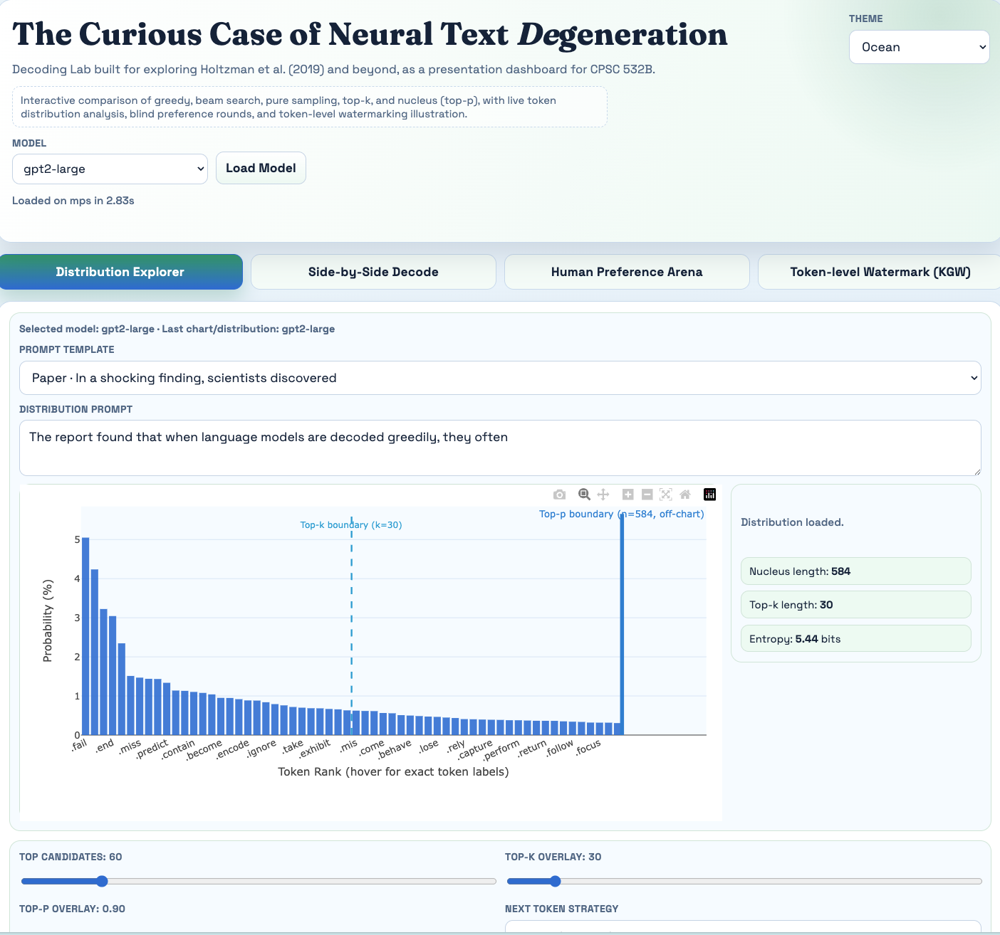
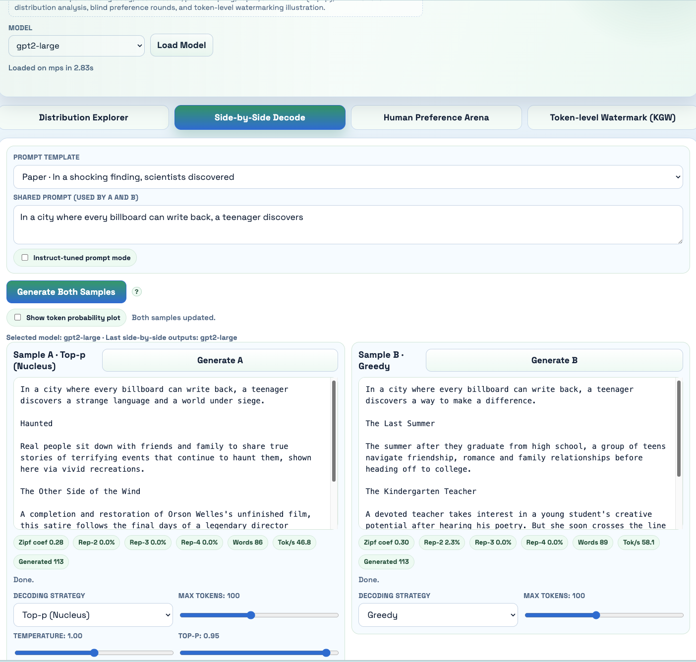
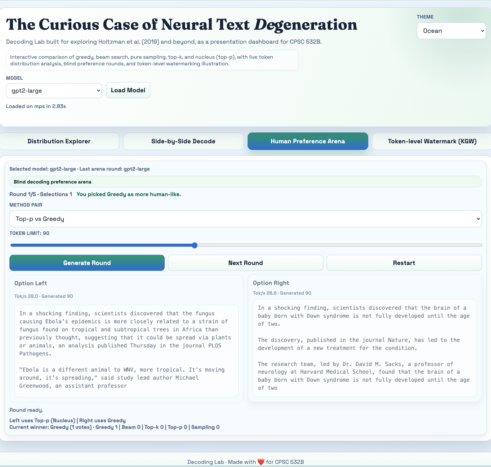
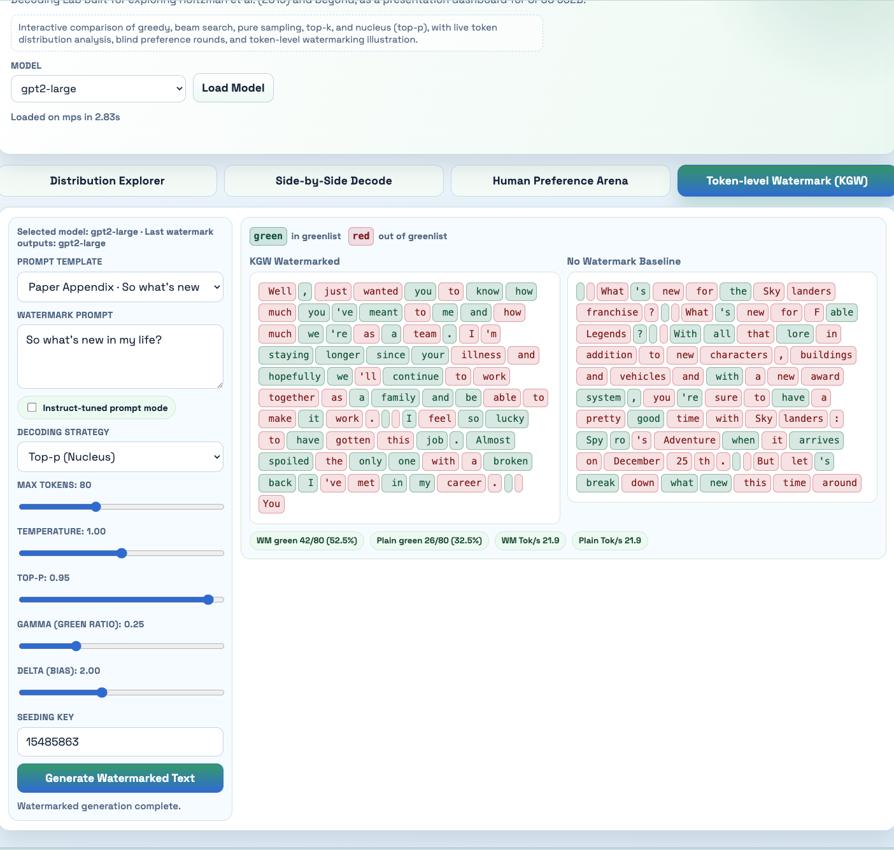

# The Curious Case of Neural Text Degeneration

Decoding Lab built for exploring Holtzman et al. (2019) and beyond, as a presentation dashboard for CPSC 532B.

Interactive comparison of greedy, beam search, pure sampling, top-k, and nucleus (top-p), with live token distribution analysis, blind preference rounds, and token-level watermarking illustration.

## Features
- **Distribution Explorer**: next-token probability chart with top-k and top-p overlays
- **Side-by-Side Decode**: compare two decoding strategies on the same prompt
- **Human Preference Arena**: blind pairwise rounds to evaluate decoding methods
- **Token-level Watermark (KGW)**: illustrates the KGW token-level watermarking technique
## Screenshots

### Distribution Explorer


### Side-by-Side Decode


### Human Preference Arena


### Token-level Watermark (KGW)


## Requirements
- Python 3.9+
- Dependencies: `torch`, `transformers` (see `requirements.txt`)
- Internet connection for first-time model download from Hugging Face
- Recommended: 16 GB+ RAM for smooth use with `gpt2-large`

## Setup
Create an environment and then run this: 
```bash
conda activate presentation  # or your Python 3.9+ environment
pip install -r requirements.txt
```

## Run
Finally to run the server simply run this:
```bash
python3 server.py
```

Then open [http://127.0.0.1:8000](http://127.0.0.1:8000) on your browser to access the dashboard.

**Optional**: Override host/port with `HOST=127.0.0.1 PORT=8017 python3 server.py`

## Notes
- First run downloads models from Hugging Face (requires internet)
- Model initialization may take a moment; subsequent requests are faster
- Works on macOS, Linux, and Windows (only tested on macOS)
